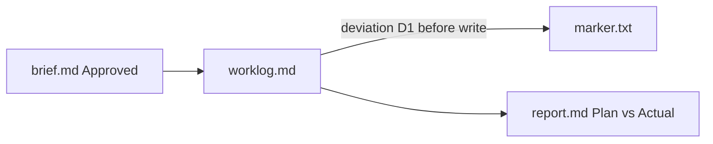

# Report — Worklog deviation dogfood

| | |
|---|---|
| **Date** | 2026-07-04 |
| **Author** | dogfood / Claude |
| **Brief** | [brief.md](./brief.md) |
| **Worklog** | [worklog.md](./worklog.md) |
| **Status** | Partially done |

> One layered document, conclusion first (pyramid): §1–§3 serve CTO and
> business readers standalone; §4+ adds engineering depth. Each section is
> modular — lift it into slides without rewriting.

## 1. Executive Summary — 30 seconds

**Audience: CTO / business.**

The dogfood run proved the **worklog captures deviations** when implementation diverges from the approved brief: deviation was logged before the off-plan file write, and the deviation register (D1) matches the worklog. The deliberate format change means the **delivery KR for the marker file content failed**, while the **process KR for logging deviations passed**.

- **Done:**
  - Worklog created from template and kept append-only; brief untouched.
  - One `deviation` row recorded before continuing past Approach step 2.
  - Deviation register D1 filled (planned YAML vs actual JSON + reason).
- **Not done / next:**
  - KR1 not met: `marker.txt` does not contain `PLANNED_FORMAT=yaml`.
  - Run the same flow via real `/doc-flow:work` in a user session (no scripted agent).
  - Optional: add project-level reminder in `CLAUDE.md` to enforce worklog on drift.
- **Decision needed:** —

> Only verifiable facts — nothing the scoreboard below cannot back up.

## 2. Business Impact

**Audience: business.**

For teams presenting work to German partners, the important outcome is **traceability**: what was agreed in the brief stays visible, and changes are recorded with reasons instead of silently rewriting the plan. This exercise did not change product behavior; it validated that the documentation lifecycle can show honest plan-vs-actual, which reduces review friction and trust risk when KRs are scored against evidence.

## 3. Key Results — Scoreboard

| # | Key Result | Target | Actual | Score | Evidence |
|---|---|---|---|---|---|
| KR1 | Marker file exists with planned content | `PLANNED_FORMAT=yaml` in `marker.txt` | `ACTUAL_FORMAT=json` + JSON line | ❌ | `grep PLANNED_FORMAT=yaml marker.txt` → exit 1; file contents in `marker.txt` |
| KR2 | Worklog records ≥1 deviation before continuing past step 2 | ≥1 `deviation` row + D1 in register | 1 deviation row (10:01) before step-2 write (10:02); D1 present | ✅ | `worklog.md` log table + deviation register D1 |

> Score exactly the KRs from the brief. Unverifiable → `unverified`, never ✅.

## 4. Plan vs. Actual

**Audience: engineering (from here down).**

| Planned step (from brief) | What actually happened | Deviation reason |
|---|---|---|
| 1. Create `worklog.md` from template if missing | `worklog.md` created from plugin template | — |
| 2. Write `marker.txt` as single YAML line `PLANNED_FORMAT=yaml` | `marker.txt` written as JSON header + `{"format":"json"}` | Worklog D1: fictional downstream consumer would break on YAML; JSON chosen instead (logged at 10:01 before write) |
| 3. Append `step` row for completion | Completion and KR verification rows appended | — |

_Source: worklog deviation register when available; otherwise git history +
conversation. Deviations are information, not failures._

## 5. What Changed

- `docs/work/2026-07-04-worklog-verify/brief.md`: created (Approved dogfood brief)
- `docs/work/2026-07-04-worklog-verify/worklog.md`: created; deviation + steps logged
- `docs/work/2026-07-04-worklog-verify/marker.txt`: created (off-plan JSON content)
- `docs/work/2026-07-04-worklog-verify/report.md`: this file (uncommitted)

## 6. Final Architecture & Diagrams

_Brief had no architecture diagrams. Dogfood flow (actual):_

## 7. Learnings & Follow-ups

- **Learning:** Prompt-level `/doc-flow:work` rules are sufficient for an agent **when the scenario forces a deviation**; there is still no automatic enforcement if the user codes without invoking work.
- **Follow-up:** Dogfood one real task using only `/doc-flow:work` + `/doc-flow:report` (owner: user, when convenient).

## 8. Docs Updated

_Doc Maintenance list from the brief — prove the docs stayed alive:_

- [x] Long-lived docs: none listed in brief — not needed because scope was isolated to `docs/work/2026-07-04-worklog-verify/`