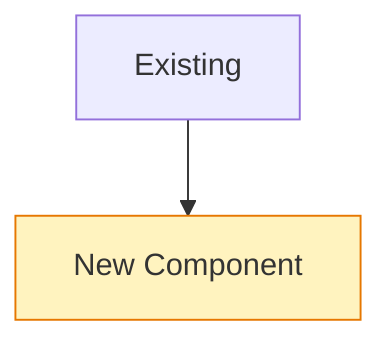
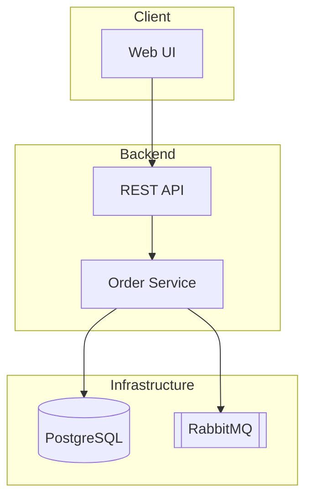
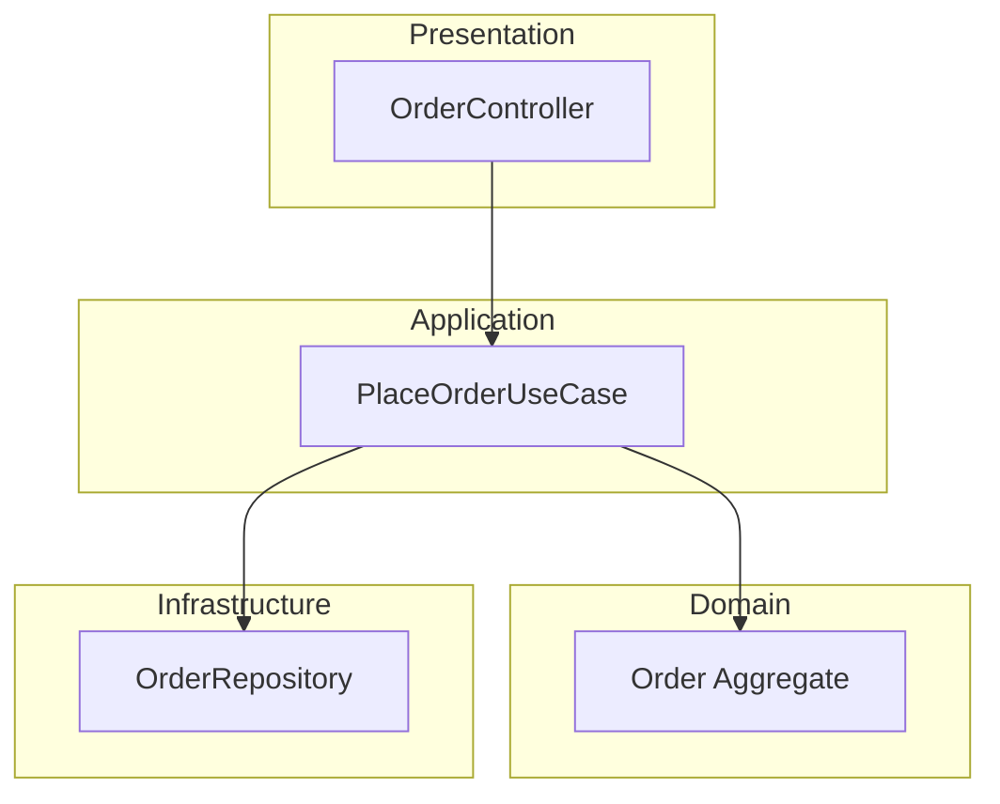
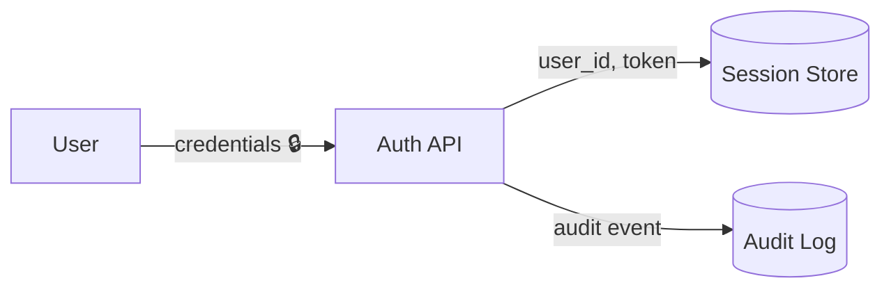

# doc-visuals — diagram & OKR conventions

## General rules (all diagrams)

- Every diagram starts with a one-line italic caption stating the **question it
  answers** (e.g. _Which component owns order state?_).
- Max ~15 nodes per diagram. More → split into overview + detail diagrams.
- Stable, kebab-case node IDs (`order-svc`, not `A`/`B`) so brief→report diffs
  stay readable.
- Only draw what exists or is explicitly planned. Planned/changed elements get
  the `changed` class:

## Architecture — `flowchart TB`

One subgraph per deployable/system boundary. Arrows = dependency/call
direction (`A --> B` means A calls/depends on B). No cycles — a cycle is a
finding, list it under Risks.

## Layer View — `flowchart TB`

One subgraph per layer (typical: Presentation / Application / Domain /
Infrastructure). **Edges may only point downward.** An upward edge is a
violation: draw it red-dashed and list it under Risks.

## Control Flow — `flowchart TD` (or `sequenceDiagram`)

Diamonds for decisions, rounded nodes for start/end. Happy path first (left),
error paths branch right. Use `sequenceDiagram` instead when ≥3 components
interact over time.

## Data Flow — `flowchart LR`

Edge labels **name the data**, not the action. Cylinders `[( )]` for stores.
Mark sensitive/PII data with 🔒.

## OKR writing rules

- **Objective**: qualitative, one sentence, answers *why this work matters*.
- **Key Results**: 2–4, each a measurable **outcome** (not a task), each with
  an explicit verification method (a command, a test, a review step).
  - Bad: "Refactor the parser" (task).
  - Good: "Parser handles all 14 fixture files without error — verified by
    `npm test parser`" (outcome + verification).
- In reports, score each KR ✅ met / ⚠️ partial / ❌ missed **with evidence**.
  Unverifiable claims are marked `unverified`, never rounded up to ✅.
