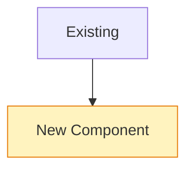
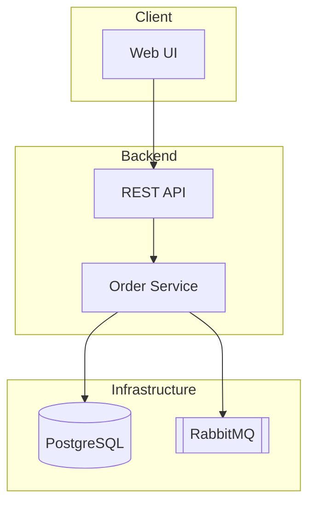
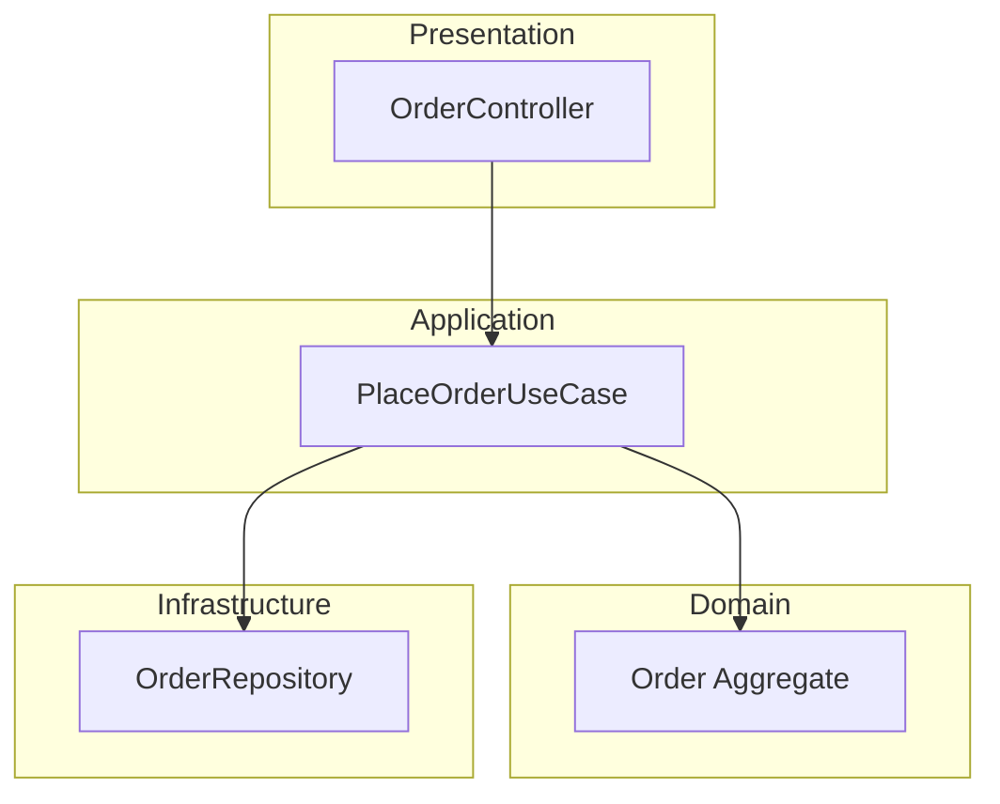
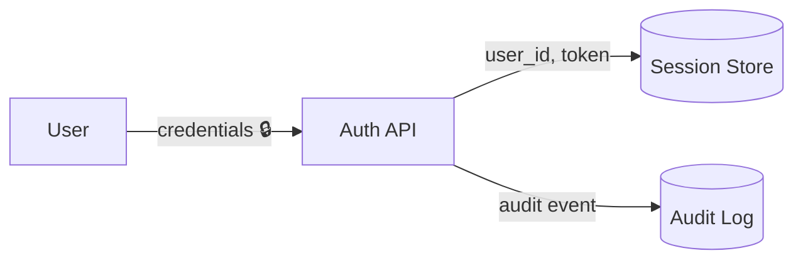

# doc-visuals — diagram, OKR & report-writing conventions

## General rules (all diagrams)

- Every diagram starts with a one-line italic caption stating the **question it
  answers** (e.g. _Which component owns order state?_).
- Max ~15 nodes per diagram. More → split into overview + detail diagrams.
- Stable, kebab-case node IDs (`order-svc`, not `A`/`B`) so brief→report diffs
  stay readable.
- Only draw what exists or is explicitly planned. Planned/changed elements get
  the `changed` class:

## Architecture — `flowchart TB`

One subgraph per deployable/system boundary. Arrows = dependency/call
direction (`A --> B` means A calls/depends on B). No cycles — a cycle is a
finding, list it under Risks.

## Layer View — `flowchart TB`

One subgraph per layer (typical: Presentation / Application / Domain /
Infrastructure). **Edges may only point downward.** An upward edge is a
violation: draw it red-dashed and list it under Risks.

## Control Flow — `flowchart TD` (or `sequenceDiagram`)

Diamonds for decisions, rounded nodes for start/end. Happy path first (left),
error paths branch right. Use `sequenceDiagram` instead when ≥3 components
interact over time.

## Data Flow — `flowchart LR`

Edge labels **name the data**, not the action. Cylinders `[( )]` for stores.
Mark sensitive/PII data with 🔒.

## OKR writing rules

- **Objective**: qualitative, one sentence, answers *why this work matters*.
- **Key Results**: 2–4, each a measurable **outcome** (not a task), each with
  an explicit verification method (a command, a test, a review step).
  - Bad: "Refactor the parser" (task).
  - Good: "Parser handles all 14 fixture files without error — verified by
    `npm test parser`" (outcome + verification).
- In reports, score each KR ✅ met / ⚠️ partial / ❌ missed **with evidence**.
  Unverifiable claims are marked `unverified`, never rounded up to ✅.

## Document writing rules (briefs & reports)

- **Overview before detail — map of the forest.** Every document opens with
  3–5 lines a zero-context reader understands: problem, expected result,
  where it sits in the bigger system. Trees, bark and leaves come after.
- **Conclusion first (pyramid).** Documents and sections state the conclusion
  first, then the supporting evidence. The executive summary must stand alone
  for a non-engineer; detail sections deepen it, never contradict it.
- **One layered document, not one per audience.** Order sections
  CTO → business → engineering so each reader stops when satisfied. Sections
  are modular: liftable into slides unchanged, one message per section, no
  forward references.
- **Status pattern** (summaries, weeklies): one honest paragraph + max 3
  "done" bullets + max 3 "next" bullets + one "decision needed" line. Only
  facts the evidence backs — no aspirational phrasing.
- **Decisions as ADR-lite rows**: decision / options considered / chosen
  because. Rejected options stay listed — they document the thinking and stop
  the debate from reopening.
- **Plan of record discipline.** After approval a brief is not edited;
  reality is appended to the worklog and reconciled in the report. Deviations
  are information, not failures.

## HTML deliverables (v0.3)

### Output paths (C3)

| Command | Writes |
|---------|--------|
| brainstorm | `brainstorm.md` |
| brief | `brief.html` |
| work | `worklog.md` |
| report | `report.html` + `index.html` |

Do **not** write `brief.md` or `report.md` to task folders. Section checklists:
`templates/brief-sections.md`, `templates/report-sections.md`.

### Viz plan (required before HTML)

Before writing any HTML, list 3–8 lines: **section → pattern ID(s) → why HTML
beats markdown** for that section. No decorative charts.

### Pattern catalog

| ID | Use when | Capability |
|----|----------|------------|
| `lane-nav` | All partner HTML | Fixed nav, § anchors, pyramid order |
| `kr-bars` | Brief §2 KR, report §3 | Canvas bars + evidence table |
| `flow-play` | Brief §6–9, report §6 | SVG paths, play particle, dashed deviation |
| `timeline` | Bundle / report PvA | Canvas + slider from worklog rows |
| `split-morph` | Deviation / format drift | Two-pane + blend slider |
| `verify-sim` | KR verification | Button shows command + exit code |
| `adr-table` | Key decisions | Table + optional term popover |
| `pyramid-exec` | Report §1–3 | Exec + scoreboard cards |
| `embed-worklog` | `index.html` only | Full tables + #viz sharing same data |

### Minimum interactivity

- **`brief.html`:** ≥2 interactive/animated elements; if §6 or §8 relevant,
  ≥1 interactive diagram (SVG).
- **`report.html`:** KR viz + plan-vs-actual viz (timeline or highlighted table).
- **`index.html`:** Full embed of brief + worklog + report + `#viz` (≥2
  interactive views; shared data arrays with embedded tables).

### Frozen brief

After **Approved**, do not edit `brief.html`. Deviations → `worklog.md`;
reconcile in `report.html` / `index.html`.

### Templates & aesthetic

Load `${CLAUDE_PLUGIN_ROOT}/templates/brief.html`, `report.html`, `bundle.html`.
Inline CSS from `templates/html-shared.css`. **warm_dynamic** DNA (paper/navy,
Space Grotesk + Newsreader + JetBrains Mono). Reference structure/viz only:
`docs/work/2026-07-04-worklog-verify/index.html`.

Use Mermaid while **reasoning** in `/brief`; in HTML output prefer **SVG/canvas**
when play, scrub, or highlight adds clarity.

### Hybrid: dynamic + AI images (v0.4)

**Canonical bundle:** `index.html` per `docs/work/2026-07-04-worklog-verify/index.html`.

| Layer | Where in index | Tool |
|-------|----------------|------|
| Dynamic (required) | `#viz` | canvas/SVG JS — KR, timeline, flow play, grep sim |
| AI sketch (optional) | `#viz-story` | `generated-images/*.png` from `viz-spec.imageRequests` + `scripts/generate-viz-images.mjs` |
| Text truth | `#report`, tables | Always — images illustrate only |

**Use `ai-image` when:** nested block story (B1,B2,B3), partner-facing metaphor, architecture Mermaid cannot express readably.

**Do not** use AI for: exact KR %, grep output, file contents — use dynamic + tables.

### Factual accuracy (ask, then draw)

Before `/report` HTML: read `docs/MENTAL-MODEL.md`, `docs/REPORT-INTAKE.md`, `docs/DATA-CONTRACT.md`.
**Slot audit → ask user (and optional `llm_wiki_ask` for question checklist) → verify KR → HTML.**
Investigation: scope-first git + expand; KR from brief + verify only — never ✅ without evidence.
Report may be **short**; gaps = **Open:** bullets, not filler. Viz `#viz` numbers must match §3 table.
Embed in index must match the same folder's files — not another task or README alone.

Spec: `docs/superpowers/specs/2026-07-06-doc-flow-index-ai-integration-report.md`
