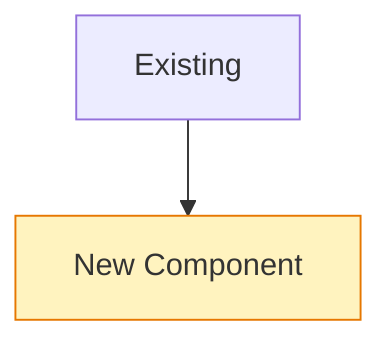
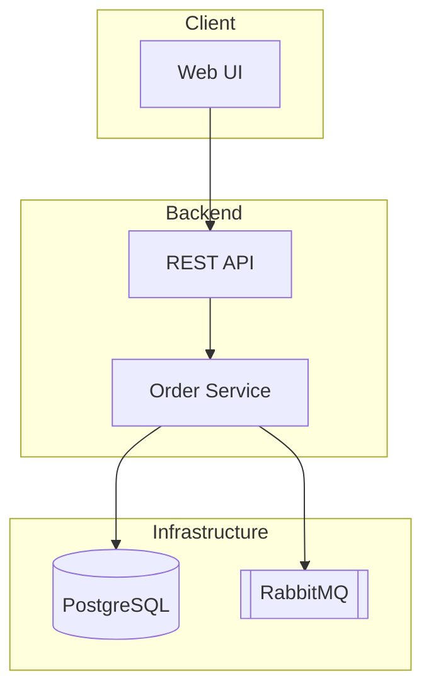
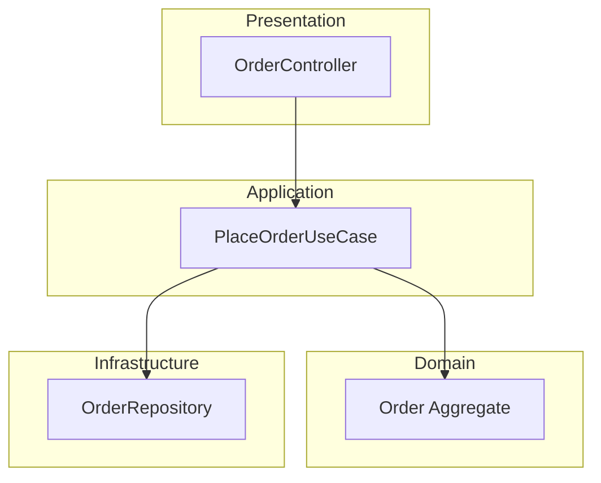
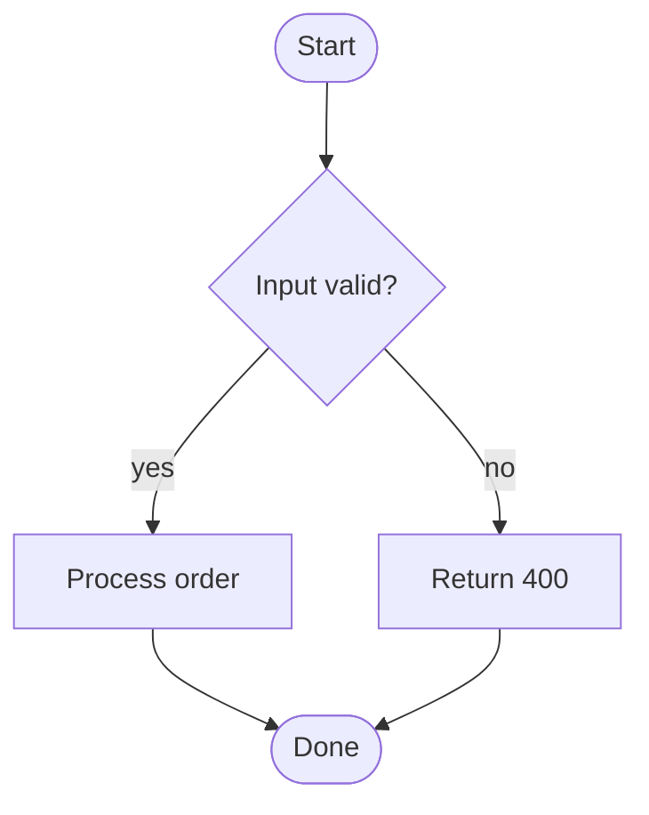
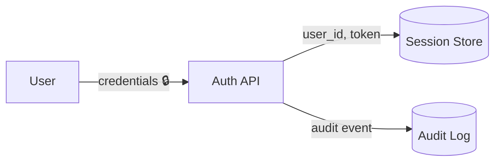

# doc-visuals — diagram, OKR & report-writing conventions

## General rules (all diagrams)

- Every diagram starts with a one-line italic caption stating the **question it
  answers** (e.g. _Which component owns order state?_).
- Max ~15 nodes per diagram. More → split into overview + detail diagrams.
- Stable, kebab-case node IDs (`order-svc`, not `A`/`B`) so brief→report diffs
  stay readable.
- Only draw what exists or is explicitly planned. Planned/changed elements get
  the `changed` class:

## Architecture — `flowchart TB`

One subgraph per deployable/system boundary. Arrows = dependency/call
direction (`A --> B` means A calls/depends on B). No cycles — a cycle is a
finding, list it under Risks.

## Layer View — `flowchart TB`

One subgraph per layer (typical: Presentation / Application / Domain /
Infrastructure). **Edges may only point downward.** An upward edge is a
violation: draw it red-dashed and list it under Risks.

## Control Flow — `flowchart TD` (or `sequenceDiagram`)

Diamonds for decisions, rounded nodes for start/end. Happy path first (left),
error paths branch right. Use `sequenceDiagram` instead when ≥3 components
interact over time.

## Data Flow — `flowchart LR`

Edge labels **name the data**, not the action. Cylinders `[( )]` for stores.
Mark sensitive/PII data with 🔒.

## OKR writing rules

- **Objective**: qualitative, one sentence, answers *why this work matters*.
- **Key Results**: 2–4, each a measurable **outcome** (not a task), each with
  an explicit verification method (a command, a test, a review step).
  - Bad: "Refactor the parser" (task).
  - Good: "Parser handles all 14 fixture files without error — verified by
    `npm test parser`" (outcome + verification).
- In reports, score each KR ✅ met / ⚠️ partial / ❌ missed **with evidence**.
  Unverifiable claims are marked `unverified`, never rounded up to ✅.

## Document writing rules (briefs & reports)

- **Overview before detail — map of the forest.** Every document opens with
  3–5 lines a zero-context reader understands: problem, expected result,
  where it sits in the bigger system. Trees, bark and leaves come after.
- **Conclusion first (pyramid).** Documents and sections state the conclusion
  first, then the supporting evidence. The executive summary must stand alone
  for a non-engineer; detail sections deepen it, never contradict it.
- **One layered document, not one per audience.** Order sections
  CTO → business → engineering so each reader stops when satisfied. Sections
  are modular: liftable into slides unchanged, one message per section, no
  forward references.
- **Status pattern** (summaries, weeklies): one honest paragraph + max 3
  "done" bullets + max 3 "next" bullets + one "decision needed" line. Only
  facts the evidence backs — no aspirational phrasing.
- **Decisions as ADR-lite rows**: decision / options considered / chosen
  because. Rejected options stay listed — they document the thinking and stop
  the debate from reopening.
- **Plan of record discipline.** After approval a brief is not edited;
  reality is appended to the worklog and reconciled in the report. Deviations
  are information, not failures.
